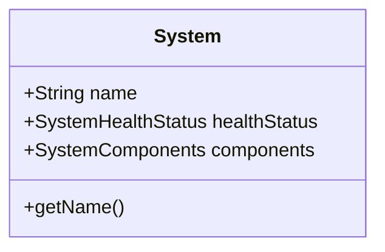
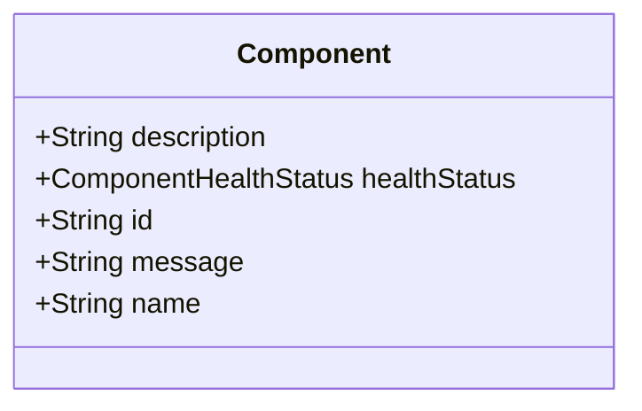
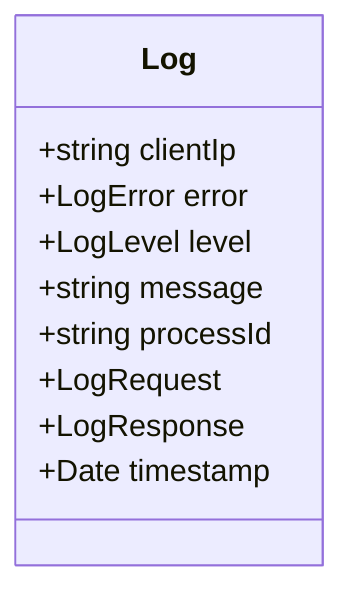
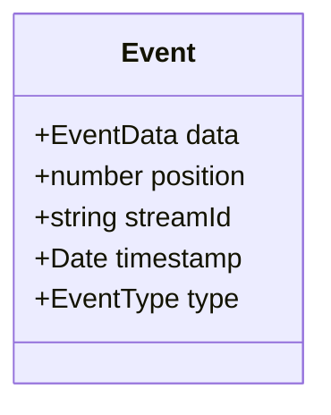
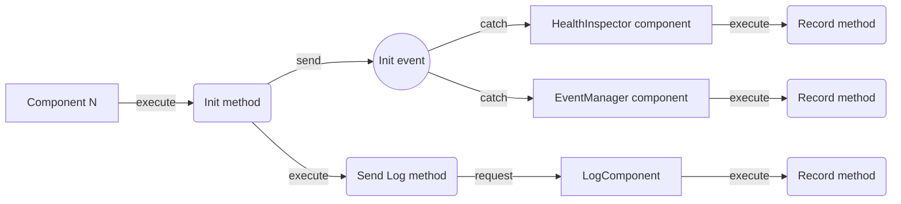
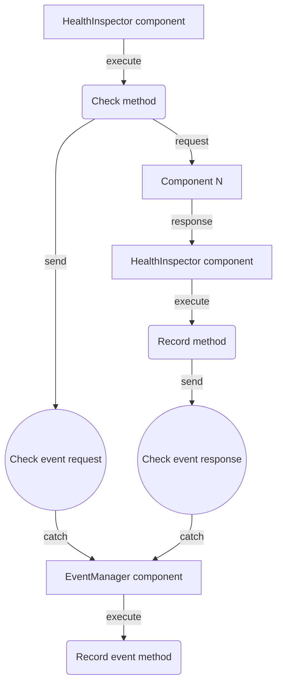
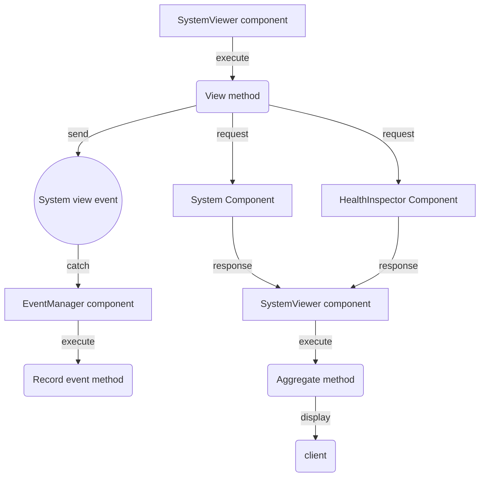

# Clearsight

[[_TOC_]]

✨ **This workspace has been generated by [Nx, Smart Monorepos · Fast CI.](https://nx.dev)** ✨

## Domain business

### System

### Component

### Log

### Event

## List of components

### The system component

Provide the name of the system.

### The system viewer component

Display a summary of the state of the system: its name and the list of the components with their health status.

### The logManager component

Handle the logs: catch, record and read the logs.

### The eventManager component

Handle the events: catch, record and read the events.

### The healthInspector component

Collect all components present in the system and check their health status.

Provide all components with their health status.

## Context map

### Component initialization

### Healthcheck of the components

### View of a the system component

