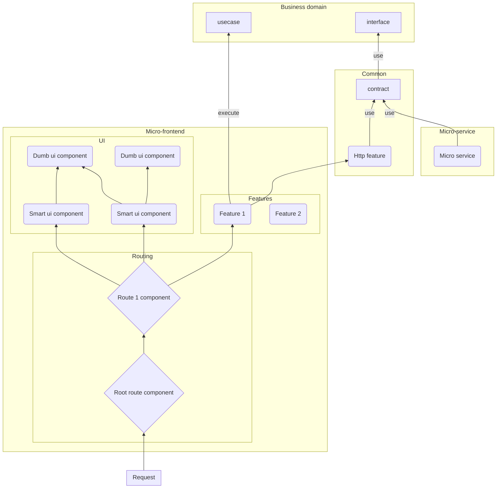

# Clearsight

- [Clearsight](#clearsight)
  - [Business domain](#business-domain)
    - [System](#system)
    - [Component](#component)
    - [Log](#log)
    - [Event](#event)
  - [List of components](#list-of-components)
    - [The system component](#the-system-component)
    - [The system viewer component](#the-system-viewer-component)
    - [The logManager component](#the-logmanager-component)
    - [The eventManager component](#the-eventmanager-component)
    - [The healthInspector component](#the-healthinspector-component)
  - [Context map](#context-map)
    - [Component initialization](#component-initialization)
    - [Healthcheck of the components](#healthcheck-of-the-components)
    - [View of a the system component](#view-of-a-the-system-component)
  - [Clean architecture](#clean-architecture)
    - [Micro-frontend](#micro-frontend)
      - [Dependency tree](#dependency-tree)
      - [Control flow](#control-flow)
    - [Micro-service](#micro-service)

✨ UNDER CONSTRUCTION ✨

## Business domain

### System


### Component


### Log


### Event


## List of components

### The system component

Provide the name of the system.

### The system viewer component

Display a summary of the state of the system: its name and the list of the components with their health status.

### The logManager component

Handle the logs: catch, record and read the logs.

### The eventManager component

Handle the events: catch, record and read the events.

### The healthInspector component

Collect all components present in the system and check their health status.

Provide all components with their health status.

## Context map

### Component initialization


### Healthcheck of the components


### View of a the system component


## Clean architecture

### Micro-frontend

#### Dependency tree



#### Control flow


### Micro-service

```
📦src
 ┣ 📂utils
 ┃ ┣ 📜README.md
 ┃ ┣ 📜another.js
 ┃ ┣ 📜constants.js
 ┃ ┗ 📜index.js
 ┣ 📜README.md
 ┣ 📜app.js
 ┣ 📜models.js
 ┗ 📜routes.js
```